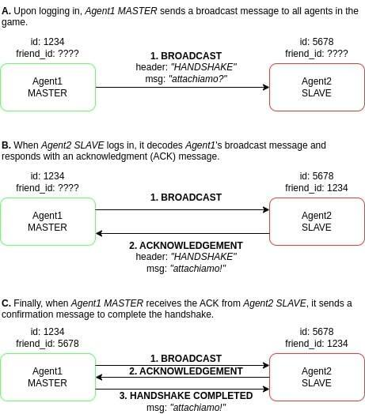

# **Autonomous Software Agents**
<div>
    
    
    
    
</div>

# Table of contents
-   [Project Overview](#project-overview)
    - [Agent Structures](#agent-structures)
    - [Agent Belief System](#agent-belief-system)
    - [Intention Loop](#intention-loop)
    - [Planning](#planning)
    - [Communication](#communication)
    - [Results](#results)
    - [Conclusion and Future Improvements](#conclusion-and-future-improvements)
-   [Project structure](#project-structure)
-   [Getting Started](#getting-started)
    - [1. Download the Required Repositories](#1-download-the-required-repositories)
    - [2. Running the Code](#2-running-the-code)
-   [Contacts](#contacts)

# Project Overview
<p align="center">
  
</p>
This project focuses on developing autonomous agents for the Deliveroo game, where agents collect and deliver parcels to designated points to earn points. The agents are designed using a **Belief-Desire-Intention (BDI)** architecture, which allows them to perceive their environment, form goals, plan their actions, and continuously adapt to dynamic conditions.

The project consists of two parts:
- **Single Agent**: A single agent capable of interpreting the environment, updating its beliefs, and taking actions to achieve its goals.
- **Multi-Agent**: A system with two agents working together, sharing information and coordinating actions to complete tasks more efficiently.

The agent's performance is evaluated across multiple levels, with the results available in `documentation/results.md`.

## 1. Agent Structures

Two main structures, `Me` and `Map`, are used to manage the agent’s state and environment:

- **Me**: Represents the agent's state and holds information like position, score, whether the agent is carrying a parcel, and its intentions.
- **Map**: Represents the environment, providing information about the layout, reachable tiles, delivery points, and any known parcel locations.

## 2. Agent Belief System

The agent continuously updates its knowledge through interactions with the environment. The key components of this belief system include:

- **Map Info**: Helps with tasks like pathfinding, deadlock resolution, and updating the belief set.
- **Parcel Sensing**: Detects available parcels, prioritizes them for pickup based on proximity, and shares this information with teammates.
- **Agent Sensing**: Detects other agents and updates their positions, helping with coordination and conflict avoidance.

## 3. Intention Loop

The agent operates within the BDI model, continuously evaluating and acting on its intentions. The agent prioritizes:
1. **Picking up parcels**.
2. **Delivering parcels** if it’s already carrying one.
3. **Moving randomly** if no other action is available.

If the agent fails to execute an intention, it retries or drops the parcel, and after multiple failures, it returns to its previous position.

## 4. Planning

The agent uses two main approaches for pathfinding:

- **BFS (Breadth-First Search)**: Finds the shortest path to a destination in an unweighted grid, ensuring the agent can move efficiently through the environment.
- **PDDL (Planning Domain Definition Language)**: Generates a more sophisticated movement plan based on predefined domain knowledge. However, it faces latency issues due to the need for an online solver.

## 5. Communication

In multi-agent scenarios, communication is key. Agents exchange information on their positions and the locations of parcels. They use a handshake protocol to establish a connection and coordinate their actions. Moreover, when agents block each other, a conflict resolution system ensures that one agent moves out of the way to allow the other to continue.

### Handshake Protocol

To begin cooperation, agents establish a connection through a simple handshake:
- The MASTER agent sends the message `"attacchiamo?"` (asking to connect).
- The SLAVE agent responds with `"attacchiamo!"` to confirm the connection.
- Both agents set their `friend_id` to maintain a persistent link for further communication.

This handshake ensures both agents are synchronized and ready to collaborate.
<p align="center">
  
</p>

### Sharing Environmental Information
Once connected, agents share critical environmental data, which helps them make informed decisions:
- `INFO_PARCELS`: Sent when more than two parcels are detected. The receiving agent updates its knowledge and prioritizes parcels based on their proximity and reward value, moving towards them if conditions are met.
- `INFO_AGENTS`: Informs agents about the location and status of other agents, enabling them to avoid conflicts and coordinate actions, such as preventing blocks at delivery points.

### Conflict Resolution
When agents block each other, the `STUCKED_TOGETHER` message is used to resolve the issue:
- The agent closer to the center of the map sends the message to the other agent, determining who should move.
- The recipient checks if it can move and clears the obstruction. If not, the other agent moves.
<p align="center">
  
</p>
<p align="center">
  
</p>

## 6. Results

The agents were tested on both single-agent and multi-agent levels in 5-minute gameplay sessions. Results, including performance data and comparisons across levels, are available in ```documentation/results.md```.

## 7. Conclusion and Future Improvements

The autonomous agent system successfully completed tasks in dynamic environments, adapting its strategies using the BDI architecture. The BFS pathfinding method was effective, while the PDDL planner faced challenges due to latency. Future improvements will focus on enhancing multi-agent coordination, optimizing pathfinding, and exploring learning-based methods to improve adaptability and performance in more complex, real-world scenarios.

# Project structure

```text
.
├── assets          # Images
├── documentation   # Report, Presentation and Results
└── libs            # Source files
    ├── actions     # Action implementations defining agent behaviors
    ├── intentions  # Intentions representing agent goals and plans
    ├── messages    # Communication system for inter-agent messaging
    └── utils       # Utility functions and helper modules
```

# Getting Started

### **1. Download the Required Repositories**
First, clone the necessary repositories:

```bash
git clone https://github.com/unitn-ASA/Deliveroo.js
git clone https://github.com/bolognapietro/AutonomousSoftwareAgents_Deliveroo-Agents
```
### **2. Running the Code**

#### **Start the Simulation**
Navigate to the `Deliveroo.js` folder and launch the game:

```bash
cd Deliveroo.js
node index.js level_1
```

Then, open a browser and go to [http://localhost:8080](http://localhost:8080).

#### **Run the Agent Manually**

- **Single Agent Scenario:**  
  Open a terminal and run:
  
  ```bash
  cd AutonomousSoftwareAgents_Deliveroo-Agents
  node main.js agent1
  ```

- **Multi-Agent Scenario:**  
  1. Open a terminal and start the slave agent:
     
     ```bash
     cd AutonomousSoftwareAgents_Deliveroo-Agents
     node main.js agent2 slave
     ```
  
  2. Open another terminal and start the master agent:
     
     ```bash
     cd AutonomousSoftwareAgents_Deliveroo-Agents
     node main.js agent1 master
     ```

Once running, return to the browser, and you will see them move autonomously.

# Contacts
Marina Segala - [marina.segala@studenti.unitn.it](mailto:marina.segala@studenti.unitn.it)
\
Pietro Bologna - [pietro.bologna@studenti.unitn.it](mailto:pietro.bologna@studenti.unitn.it)


<div>
    <a href="https://www.unitn.it/">
        
    </a>
</div>